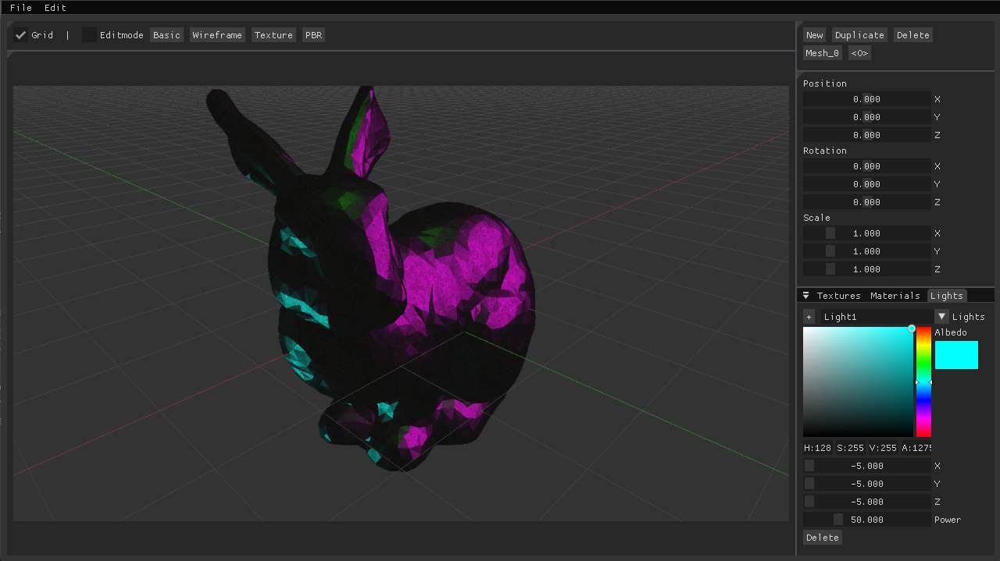

<a id="readme-top"></a>
# BE : Real-time 3D Engine

<br />
<div align="center">
  <a href="https://github.com/Auxemite/Blender_eco/">
     <!-- width="80" height="80"> -->
  </a>
</div>

<!-- ABOUT THE PROJECT -->
## About The Project

The goal of this project is to build an open-source real-time 3D engine entriely from scratch. This project is an opportunity to experiment with and implement various features and optimizations commonly used in modern real-time 3D rendering. For the graphical user interface we used Dear IMGUI with GLFW and OpenGL.

### Aimed features :
* Load and save 3D scenes in various formats
* Move, rotate, and scale any mesh in real time
* Dynamic camera system
* Dynamic materials and textures
* Add and edit lights
* Skybox support
* Shadow management
* Transparent object rendering
* Post-processing stack
* Procedural generation

### Aimed rendering optimizations :
* Bounding boxes
* Culling tests (frustum, backface and distance culling)
* Z-prepass
* Deferred rendering
* Mipmapped textures
* Mesh LOD
* Probe lights.

<!--
### Render Modes
* The “Raycast Render” button provides access to simple raycasting rendering (not real time).
* The “Normals” button switches to classic real-time rendering of 3D modeling software using the mesh normals.
* The “Outlines” button switches to real-time rendering using outlines only.
* The “Phong” button switches to real-time Phong rendering.
* The “BRDF” button switches to real-time PBR rendering with a Labertian diffuse BRDF and a Cook-Torrance GGX specular BRDF.
* Options to change the light intensity.
* Options for changing the materials of a mesh for Phong and PBR in real time.

### Bonus Features
* Option to simulate hair in a very simplified way using tessellation shader with the “fur only” button or the “fur” checkbox. Addition of customization options (fur length, fur size, and tessellation surface).
* Option to distort meshes using sinusoids with the “wave” button. It is possible to distort a mesh with sinusoids in all directions with any dependency, amplitude, and frequency (can be combined with hair simulation).

For this software version, we used modern rasterization light management techniques (PBR) as well as advanced OpenGL features (geometry shader, tessellation shader).
-->

## Built With

The project is in C++ 20 and the interface has been developped with IMGUI/OPGL/GLFW.
* [![Cpp][Cpp.cpp]][Cpp-url]
* [![OpenGL][OP.GL]][OPGL-url]
* [![ImGUI][IM.GUI]][IMGUI-url]
* [![GLFW][GL.FW]][GLFW-url]

## Getting Started

This project has been developped on Windows 10 and Linux and should work on both. (Not tested on MacOs)

### Prerequisites
`Opengl 4.5` and C++20 are required to run this project.

`Glad`, `Glfw`, `Glm` and `Imgui` are directly inside de project in the "external" folder.

### Installation

1. Clone the repo
```sh
git clone https://github.com/Auxemite/Blender_eco
```

2. Build
```sh
cmake -B build .
cp imgui.ini build/imgui.ini
```

3. Run
``` sh
cd build
./blender_eco
```

<p align="right">(<a href="#readme-top">back to top</a>)</p>

<!-- AUTHORS -->
## Authors
- Ernest Bardon
- Kael Facon

<!-- MARKDOWN LINKS & IMAGES -->
<!--5586a6-->
[OP.GL]: https://img.shields.io/badge/opengl-FFFFFF?logo=opengl&style=for-the-badge
[OPGL-url]: https://opengl.org/

[Cpp.cpp]: https://img.shields.io/badge/c++-00599C?logo=c%2B%2B&style=for-the-badge
[Cpp-url]: https://www.cppreference.com/

[IM.GUI]: https://img.shields.io/badge/IMGUI-151617?logo=imgui&style=for-the-badge&logoColor=white
[IMGUI-url]: https://github.com/ocornut/imgui

[GL.FW]: https://img.shields.io/badge/GLFW-ff9a29?logo=glfw&style=for-the-badge
[GLFW-url]: https://glfw.org/
